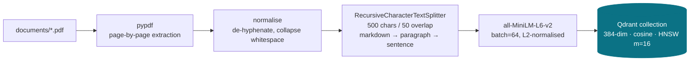
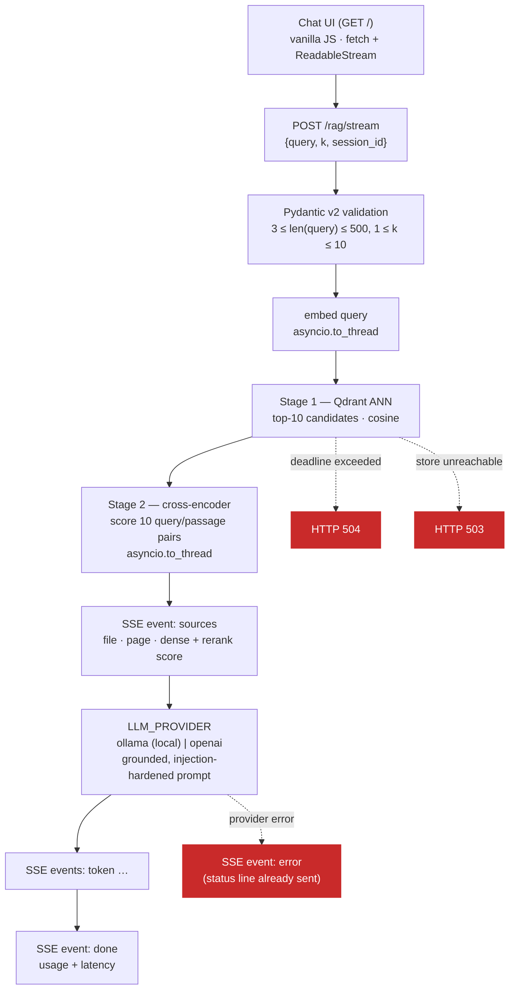
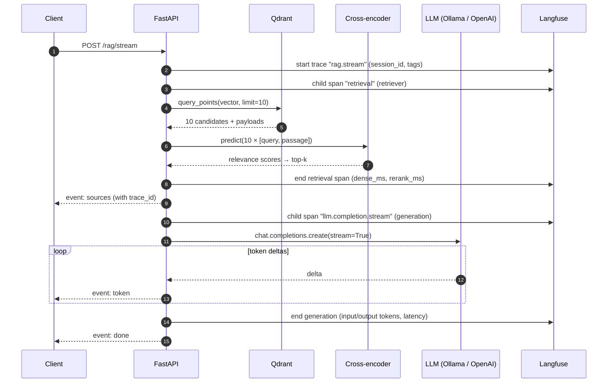

# rag_documents — asynchronous RAG microservice

A production-shaped Retrieval-Augmented Generation service: **two-stage retrieval**
(dense recall in Qdrant → cross-encoder reranking), **token-level SSE streaming**,
hard deadlines, sanitised error handling, **Langfuse** tracing, a **Ragas**
evaluation harness and a dependency-free **web chat client**.

It runs **fully offline by default** — retrieval, reranking *and* generation all
happen on the machine via a local Ollama model. Flip one environment variable to
use OpenAI (or any OpenAI-compatible gateway) instead. Every cache stays inside
the project directory.

```
FastAPI (async)  ·  Qdrant 1.19  ·  all-MiniLM-L6-v2  ·  BAAI/bge-reranker-base
Ollama llama3.1:8b  or  gpt-4o-mini (SSE)  ·  vanilla-JS chat UI  ·  Langfuse v4
Ragas  ·  uv  ·  mypy --strict  ·  107 tests
```

---

## 1. Architecture

### 1.1 Ingestion (offline)



Each chunk keeps its provenance (`source`, `page`, `chunk_index`) and gets a
**deterministic `uuid5` id**, so re-running ingestion updates points in place
instead of duplicating the corpus.

### 1.2 Query path (online)



### 1.3 Request lifecycle with tracing



---

## 2. Why two stages?

A bi-encoder embeds the query and the document **independently**, so document
vectors can be precomputed and searched in sub-linear time — but the model never
sees the pair together. A cross-encoder feeds `[query, passage]` through one
transformer with full cross-attention, which is far more accurate and
fundamentally **not** precomputable: cost grows linearly with the number of
candidates.

| | Bi-encoder (stage 1) | Cross-encoder (stage 2) |
|---|---|---|
| Model | `all-MiniLM-L6-v2` (22M) | `BAAI/bge-reranker-base` (278M) |
| Input | query *or* passage | query **and** passage together |
| Precomputable | yes — vectors live in Qdrant | no — depends on the query |
| Complexity at query time | O(log n) ANN over the whole corpus | O(k) forward passes |
| Measured p50 (below) | **12.8 ms** | **341 ms** for 10 pairs |
| Failure mode | lexically/semantically "near" but wrong | too slow to scan a corpus |

Used together, the bi-encoder provides **recall** over the whole index and the
cross-encoder provides **precision** over a small candidate set. Tune the trade-off
with `RETRIEVAL_CANDIDATES` (recall ceiling, rerank cost) and `RERANK_TOP_N`
(prompt size, grounding precision).

### Measured on this machine

Apple M-series, CPU inference, 18-chunk corpus, 10 candidates → top-3,
median of 18 warm runs (`src/retriever.py` reports the split per request):

| Stage | p50 | min | max |
|---|---:|---:|---:|
| Dense retrieval (embed + Qdrant ANN) | 12.8 ms | 11.7 ms | 22.5 ms |
| Cross-encoder rerank (10 pairs) | 341.4 ms | 311.5 ms | 410.1 ms |
| **Total retrieval** | **354.5 ms** | | |

Reranking is ~96% of retrieval latency — but it is still an order of magnitude
cheaper than the LLM call it feeds, and it is what keeps the prompt small and
grounded. On this deliberately tiny sample corpus the reranker changed the top-1
result for 1 of 6 benchmark questions; on a real corpus with many near-duplicate
passages, that ratio rises sharply — which is exactly what `context_precision`
in the evaluation harness measures.

### CPU vs. a dedicated inference server

This repo runs both models **in-process on CPU** — the right call for a demo, a
single-tenant internal tool, or any deployment where simplicity beats
throughput: one container, no GPU, no extra network hop, and `asyncio.to_thread`
keeps the event loop free.

It stops being the right call when:

| Signal | Why in-process CPU breaks | Move to |
|---|---|---|
| Sustained concurrency > ~4 RPS | Every request occupies a worker thread for ~350 ms; the GIL and thread pool become the bottleneck | Text Embeddings Inference (TEI) / Triton / vLLM behind an internal endpoint |
| p95 latency budget < 200 ms | A base-size cross-encoder on CPU cannot meet it | GPU batch inference, or ONNX Runtime + int8 quantisation (roughly 2–4× on CPU, at a small quality cost) |
| Horizontal scaling | Every replica loads ~1.1 GB of weights and pays a cold start | Shared model server, so API replicas stay stateless and cheap |
| Multiple services need the same models | Duplicated weights, duplicated upgrades | One versioned inference service |

The seam is already in place: `TwoStageRetriever` depends on the `TextEncoder`
and `PairScorer` protocols, not on `sentence-transformers`. Swapping in an HTTP
client for TEI is a new adapter class, not a rewrite.

### Other decisions worth defending

* **Chunk 500 / overlap 50.** Large enough for a full contractual clause, small
  enough that a 3-chunk prompt stays ~1.5k characters. The separator ladder
  (markdown headings → paragraphs → lines → sentences → clauses) keeps splits on
  semantic boundaries; each page is chunked independently so page citations are
  never wrong.
* **Cosine + normalised vectors.** `normalize_embeddings=True` at both ingest and
  query time makes cosine equivalent to a dot product, and MiniLM is trained for
  cosine.
* **SSE, not WebSockets.** Generation is strictly server→client; SSE is plain
  HTTP, survives proxies, auto-reconnects in the browser, and needs no extra
  protocol handling. `X-Accel-Buffering: no` stops nginx buffering the stream.
* **Retrieval before the response starts.** Retrieval failures map to real HTTP
  codes (504/503). Once the stream is open the status line is committed, so
  generation failures arrive as a terminal `error` event instead.
* **Deterministic point ids.** Re-ingestion is idempotent; no "delete everything
  and hope" step in the pipeline.

---

## 3. Quickstart

### Prerequisites

* macOS arm64 (or Linux), Docker, [`uv`](https://docs.astral.sh/uv/), optionally `direnv`
* An LLM backend — either is fine:
  * **local (default)**: [Ollama](https://ollama.com) with a pulled model — no key, no egress
  * **hosted**: an OpenAI API key, or any OpenAI-compatible gateway via `OPENAI_BASE_URL`

### 3.1 Environment

```bash
cp .env.example .env          # then set OPENAI_API_KEY
direnv allow .                # optional: pins venv + all caches into the project
```

Without `direnv`, export the hygiene variables yourself:

```bash
export UV_PROJECT_ENVIRONMENT="$PWD/.venv"
export UV_CACHE_DIR="$PWD/.cache/uv"
export HF_HOME="$PWD/.cache/huggingface"
export TOKENIZERS_PARALLELISM=false
```

### 3.2 Install (uv only — no system Python, no Poetry)

```bash
uv sync --extra eval          # creates ./.venv (Python 3.12), installs the project,
                              # the `dev` dependency group and the Ragas harness
uv run pytest -q              # every command runs against the locked graph
```

`uv.lock` is committed and is the source of truth. `requirements.txt` is
exported from it (`uv export --all-extras --format requirements-txt`) with
hashes, for environments that must use plain `pip`:

```bash
uv pip sync requirements.txt  # or: pip install --require-hashes -r requirements.txt
```

### 3.3 LLM backend

**Local (default).** Pull a model once, then leave the daemon running:

```bash
ollama run llama3.1:8b     # downloads ~4.9 GB on first run, then opens a prompt
# Ctrl-D to leave the prompt; the daemon keeps serving on :11434
ollama list                # confirm the model is present
```

Nothing else is needed — `LLM_PROVIDER=ollama` is the default, and the service
talks to Ollama's OpenAI-compatible endpoint at `OLLAMA_BASE_URL`. `mistral`,
`qwen2.5`, `gemma3` and friends work the same way:

```bash
ollama pull mistral
echo "OLLAMA_MODEL=mistral" >> .env
```

**Hosted.** Two lines in `.env`:

```dotenv
LLM_PROVIDER=openai
OPENAI_API_KEY=sk-…
```

Everything downstream is identical — streaming, token accounting, Langfuse
spans and the grounding prompt are provider-agnostic; only the client's
`base_url`, credential and model id change (`build_llm_client` in `src/main.py`).

| | `ollama` (default) | `openai` |
|---|---|---|
| Data leaves the machine | never | yes, to the provider |
| Cost | free | per token |
| Key required | no (dummy is supplied) | yes, fails fast without one |
| Typical answer latency here | ~7 s warm, ~25 s on the first call (weights load) | ~1–3 s |
| Best for | demos, sensitive corpora, offline work | quality, latency, CI evaluation |

> Local models are slower, and the first request also pays for loading weights.
> Raise `GENERATION_TIMEOUT_SECONDS` if you see `generation_timeout` events on
> a cold model or a larger one.

### 3.4 Vector store

```bash
docker compose up -d                  # Qdrant on :6333, storage in ./qdrant_storage
curl -s localhost:6333/readyz         # dashboard: http://localhost:6333/dashboard
```

### 3.5 Index your own documents

Drop **any** PDFs into `documents/` — replacing the sample corpus or alongside
it — and run:

```bash
uv run python -m src.ingest --recreate     # or: uv run rag-ingest --recreate
```

```
             Skipped files
┏━━━━━━━━━━━━━━━━━━┳━━━━━━━━━━━━━━━━━━━━━━━━━━━━━━┓
┃ File             ┃ Reason                       ┃
┡━━━━━━━━━━━━━━━━━━╇━━━━━━━━━━━━━━━━━━━━━━━━━━━━━━┩
│ spreadsheet.xlsx │ unsupported file type: .xlsx │
└──────────────────┴──────────────────────────────┘
                        Corpus
┏━━━━━━━━━━━━━━━━━━━━━━━━━━━━┳━━━━━━━┳━━━━━━━━┳━━━━━━━━┓
┃ File                       ┃ Pages ┃ Chunks ┃ Status ┃
┡━━━━━━━━━━━━━━━━━━━━━━━━━━━━╇━━━━━━━╇━━━━━━━━╇━━━━━━━━┩
│ sample_policy_handbook.pdf │     5 │     18 │ ok     │
├────────────────────────────┼───────┼────────┼────────┤
│ 1 file(s)                  │     5 │     18 │ 1 ok   │
└────────────────────────────┴───────┴────────┴────────┘
                    Index
┏━━━━━━━━━━━━━━━━━━━━━━━━┳━━━━━━━━━━━━━━━━━━━━━┓
┃ Metric                 ┃               Value ┃
┡━━━━━━━━━━━━━━━━━━━━━━━━╇━━━━━━━━━━━━━━━━━━━━━┩
│ collection             │        rag_documents │
│ mode                   │           recreated │
│ vector size / distance │        384 / cosine │
│ points upserted        │                  18 │
│ points in collection   │                  18 │
└────────────────────────┴─────────────────────┘
✓ Ingestion complete — the index is ready to query.
```

The run is **defensive by design**, because real corpora are messy:

| Situation | Behaviour |
|---|---|
| `notes.txt`, `deck.pptx`, a sub-directory, a 0-byte file | listed in *Skipped files* with a reason, and logged — never silently ignored |
| A corrupt page inside an otherwise good PDF | that page is skipped and counted; the file still indexes (`2 page(s) unreadable`) |
| A PDF that cannot be opened at all, or is encrypted | the file is marked `unreadable` / `encrypted`; the rest of the corpus still indexes |
| A scanned, image-only PDF | marked `no text layer`, with a hint to run OCR first |
| Re-running ingestion | ids are `uuid5(source, page, chunk_index)`, so points are **updated in place**, not duplicated |

Flags: `--recreate` (drop and rebuild the collection), `--dry-run`
(extract and chunk only — no model download, no Qdrant), `--documents-dir PATH`
(index a directory outside the project).

### 3.6 Run the service

```bash
uv run uvicorn src.main:app --reload --port 8000
```

* Chat UI — <http://localhost:8000/>
* OpenAPI — <http://localhost:8000/docs>

First start downloads ~1.1 GB of retrieval model weights into
`.cache/huggingface` (the LLM itself lives in Ollama, or in the cloud).

---

## 4. API and web client

| Method | Path | Purpose | Notable statuses |
|---|---|---|---|
| `GET` | `/` · `/chat` | Web chat client (HTML) | `200` |
| `GET` | `/health` | Liveness + index readiness, active provider | `200` (`status: ok\|degraded`) |
| `POST` | `/rag/search` | Retrieval only — no LLM call | `422`, `503`, `504` |
| `POST` | `/rag/answer` | Buffered grounded answer | `422`, `502`, `503`, `504` |
| `POST` | `/rag/stream` | SSE: sources → tokens → done | `422`, `503`, `504` |

Request body: `{"query": "…", "k": 3, "session_id": "optional"}` — `query` is
3–500 characters (whitespace-stripped), `k` is 1–10, unknown fields are rejected.

### Retrieval

```bash
curl -s localhost:8000/rag/search -H 'content-type: application/json' \
  -d '{"query":"How much notice is needed to terminate the agreement?","k":3}'
```

```json
{
  "query": "How much notice is needed to terminate the agreement?",
  "sources": [
    {
      "source": "sample_policy_handbook.pdf",
      "page": 2,
      "chunk_index": 0,
      "dense_score": 0.68322,
      "rerank_score": 0.96117,
      "preview": "3. Commercial terms 3.1 Term and termination …"
    }
  ],
  "candidates_considered": 10,
  "retrieval_ms": 320.4
}
```

### Streaming

```bash
curl -N localhost:8000/rag/stream -H 'content-type: application/json' \
  -d '{"query":"How much notice is needed to terminate the agreement?","k":3}'
```

```
event: sources
data: {"type":"sources","query":"…","sources":[…],"candidates_considered":10,"retrieval_ms":334.9,"trace_id":"…"}

event: token
data: {"type":"token","text":"Either party "}

event: done
data: {"type":"done","usage":{"input_tokens":612,"output_tokens":48},"generation_ms":1340.2,"finish_reason":"stop"}
```

Every response carries an `X-Request-ID` header (echoed from the request when
supplied), and every error body is the same sanitised shape:

```json
{ "error": "vector_store_unavailable", "detail": "The vector store is unavailable. Please retry shortly.", "request_id": "64f42ba731cf4f1a" }
```

---

### Web chat client

`GET /` serves a single-page client for the same SSE endpoint — useful for
demos, and for showing non-engineers what "grounded" actually means.

```
┌──────────────────────────────────────────────────────────────┐
│ 📑 Document Assistant                 ● llama3.1:8b · 18 chunks │
├──────────────────────────────────────────────────────────────┤
│                                    ┌───────────────────────┐ │
│                                    │ What is the notice…?  │ │
│                                    └───────────────────────┘ │
│ ┌──────────────────────────────────────────────────────────┐ │
│ │ › Retrieved Sources & Context  [3] · reranked from 10     │ │
│ │   [1] sample_policy_handbook.pdf  page 2                  │ │
│ │       rerank 0.961   dense 0.683                          │ │
│ │       3. Commercial terms 3.1 Term and termination…       │ │
│ ├──────────────────────────────────────────────────────────┤ │
│ │ Either party may terminate the agreement for convenience  │ │
│ │ by giving thirty (30) days written notice [1].▌           │ │
│ │ ─────────────────────────────────────────────────────────│ │
│ │ retrieval 1.30 s   TTFT 2.41 s   total 25.8 s   tokens …  │ │
│ └──────────────────────────────────────────────────────────┘ │
│ [ Ask a question…                        ] passages 3  [Send]│
└──────────────────────────────────────────────────────────────┘
```

What it does:

* **Streams over `fetch` + `ReadableStream`.** `EventSource` cannot issue POST
  requests, so the SSE frames are parsed by hand (split on blank lines, read
  `event:`/`data:`, ignore keep-alive comments) — ~40 lines, no library.
* **Expandable sources badge** — file, page, cross-encoder rerank score and
  cosine dense score per passage, so a reader can audit every citation.
* **Live latency** — retrieval time from the `sources` event, **TTFT** measured
  at the first `token` event, total at `done`, plus token usage.
* **Markdown rendering** via `marked` from a CDN, pinned with an SRI hash. LLM
  output is HTML-escaped *before* parsing: passages come from user PDFs, so the
  model's output is treated as untrusted.
* **Stop button** (`AbortController`), Enter to send, Shift+Enter for a newline,
  a 500-character counter mirroring the server's own limit, and a `session_id`
  kept in `sessionStorage` so a conversation groups into one Langfuse session.
* **Zero npm, zero build step, no inline script or style** — just
  `src/static/{index.html,app.js,styles.css}` mounted at `/static`.

The UI is deliberately dumb: it holds no retrieval or prompting logic, so it
cannot drift from the API contract. A test suite asserts exactly that (every id
it binds to exists, every SSE event the API emits is handled, every payload
field it reads is declared in the Pydantic models).

---

## 5. Reliability and security

**Never block the event loop.** `model.encode` and `reranker.predict` are
CPU-bound PyTorch calls dispatched with `asyncio.to_thread`; Qdrant and OpenAI
are reached through async clients. A regression test asserts that a 200 ms
blocking `predict` does not stall concurrently scheduled coroutines.

**Deadlines everywhere.** `asyncio.timeout` bounds retrieval
(`RETRIEVAL_TIMEOUT_SECONDS`), generation (`GENERATION_TIMEOUT_SECONDS`) and the
buffered endpoint end-to-end (`REQUEST_TIMEOUT_SECONDS`). Overruns become `504`
before streaming starts, or a terminal `generation_timeout` event after.

**Sanitised failures.** Exception handlers map `TimeoutError → 504`,
`RetrievalError → 503`, `openai.APIError → 502`, anything else → `500`. Vendor
messages and stack traces are logged with the request id and never serialised to
the client; a test asserts that a planted secret in an exception message does not
appear in the response body.

**Indirect prompt injection.** Retrieved text is untrusted input. The system
prompt states that `<context>` is data; passages are fenced, enumerated and
attributed; the question travels in a separate message; and the model must reply
with a fixed refusal when the context does not support an answer. When retrieval
returns nothing, the LLM is not called at all.

**Secrets.** Only `.env` + `pydantic-settings`; `SecretStr` keeps keys out of
logs and reprs, and the resolved `llm_api_key` is a plain property rather than a
computed field precisely so it never lands in a `model_dump()` or a log line.
The placeholder key from `.env.example` is rejected at startup, and
`LLM_PROVIDER=openai` without a key fails fast instead of 401-ing per request.
No fallback key exists anywhere in the source.

**Local-first option.** With the default `LLM_PROVIDER=ollama`, documents,
queries and generated answers never leave the machine — the usual blocker for
putting a real corpus into a demo.

**Storage hygiene.** `.envrc` pins the virtualenv, uv cache, HuggingFace/torch
weights and `XDG_CACHE_HOME` inside the project, and Qdrant's volume is
`./qdrant_storage` — nothing lands on the host's internal disk.

---

## 6. Observability (Langfuse)

Set `LANGFUSE_PUBLIC_KEY` / `LANGFUSE_SECRET_KEY` (and `LANGFUSE_HOST`) and each
request produces one trace:

```
rag.stream                       session_id, tags, input, output
├── retrieval        (retriever) query, k, chunk citations, dense_ms, rerank_ms
└── llm.completion.stream (generation) model, params, prompt, completion,
                                       usage_details{input, output}, generation_ms
```

The `trace_id` is returned in the first SSE event so a client complaint can be
tied to a trace. Tracing is **strictly best-effort**: with no credentials the
service runs untraced, and if the SDK raises, the request still succeeds (a test
injects an exploding tracer and asserts a `200`).

---

## 7. Evaluation (Ragas)

```bash
uv run python -m eval.eval_ragas --dry-run      # validate wiring, zero API calls
uv run python -m eval.eval_ragas                # full benchmark
uv run python -m eval.eval_ragas --limit 3 --k 5 --judge-model gpt-4o
```

Answers are generated by whichever provider is configured (including a local
Ollama model), but **the judge is always OpenAI**: LLM-as-a-judge scores are
only comparable with a strong, stable grader, and answer relevance needs OpenAI
embeddings. So `OPENAI_API_KEY` is required for evaluation even in local mode —
the harness says so and exits cleanly rather than failing mid-run.

The harness runs the **production** retrieval and generation code over a
synthetic golden set written against `documents/sample_policy_handbook.pdf`
(9 questions, including one deliberately out-of-scope question that must trigger
a refusal, not a hallucination), then scores every sample:

| Metric | Question it answers | Why it is in the suite |
|---|---|---|
| `faithfulness` | Is every claim in the answer supported by the retrieved context? | The hallucination gate — the number a risk reviewer asks for |
| `answer_relevance` | Does the answer actually address the question? | Catches evasive or padded answers that are technically faithful |
| `context_precision` | Are the retrieved passages relevant, and ranked well? | Isolates retrieval quality from generation quality — this is where the reranker shows up |

Output: a per-sample table and an aggregate table on the console, plus
`eval/results/ragas_<timestamp>.json` (full run, config and per-sample scores)
and `.csv` (flat, for a spreadsheet or a CI artefact). The command exits `4` when
aggregate faithfulness drops below `0.70`, so it can gate a pipeline.

Scores depend on your corpus, models and judge, so no numbers are baked into this
README — run it against your own documents and commit the JSON. Useful
experiment: run once with `RERANK_TOP_N=3` and once with the reranker bypassed
(`RETRIEVAL_CANDIDATES=3`) and compare `context_precision`.

---

## 8. Tests and quality gates

```bash
uv run pytest -q                       # 107 tests, no network, no models, no Qdrant
uv run pytest --cov=src --cov-report=term-missing
uv run mypy                            # strict, including tests and eval
uv run ruff check . && uv run ruff format --check .
```

The suite replaces Qdrant, OpenAI and the ML models with deterministic fakes
(`tests/conftest.py`) while the real application code runs: validation,
two-stage retrieval, SSE framing, timeouts, error mapping and tracing.

| File | Covers |
|---|---|
| `tests/test_api.py` | Validation matrix, health states, reranked ordering, SSE event sequence, deadlines, error masking, prompt hardening, trace shape |
| `tests/test_retriever.py` | Candidate pool sizing, rerank ordering, malformed payloads, empty index, event-loop non-blocking |
| `tests/test_ingest.py` | Text normalisation, chunk boundaries, deterministic ids, unreadable PDFs, sample-corpus extraction |
| `tests/test_config.py` | Fail-fast secrets, invariants (`overlap < chunk`, `top_n ≤ candidates`), derived values |
| `tests/test_eval.py` | Golden-set loading, Ragas column mapping and NaN handling, JSON/CSV export |
| `tests/test_ui_assets.py` | Chat client ↔ API contract: bound element ids, handled SSE events, payload fields, escaped markdown, pinned CDN hash |

Line coverage of `src/` is 86% (`src/config.py` 100%, `src/models.py` 98%); the
uncovered remainder is mostly lifespan/model-loading code that only runs against
real weights.

The provider toggle is covered on both sides: `build_llm_client` is asserted to
point at `http://localhost:11434/v1` with the dummy key for Ollama and at the
OpenAI host with the real key otherwise, and an end-to-end request through the
app asserts that switching provider changes only the model id sent upstream.

---

## 9. Configuration reference

All variables live in `.env` (see `.env.example`); every one is typed and
validated at startup.

| Group | Variables |
|---|---|
| Qdrant | `QDRANT_HOST`, `QDRANT_PORT`, `QDRANT_COLLECTION`, `QDRANT_API_KEY`, `QDRANT_TIMEOUT_SECONDS` |
| LLM | `LLM_PROVIDER` (`ollama` \| `openai`) |
| — Ollama | `OLLAMA_BASE_URL`, `OLLAMA_MODEL` |
| — OpenAI | `OPENAI_API_KEY`, `OPENAI_MODEL`, `OPENAI_BASE_URL` |
| — shared | `OPENAI_TEMPERATURE`, `OPENAI_MAX_TOKENS` |
| Models | `EMBEDDING_MODEL`, `EMBEDDING_DIMENSION`, `EMBEDDING_BATCH_SIZE`, `RERANKER_MODEL`, `RERANKER_MAX_LENGTH`, `MODEL_DEVICE` |
| Retrieval | `RETRIEVAL_CANDIDATES`, `RERANK_TOP_N`, `MAX_TOP_K`, `SCORE_THRESHOLD` |
| Chunking | `CHUNK_SIZE`, `CHUNK_OVERLAP`, `DOCUMENTS_DIR`, `INGEST_UPSERT_BATCH_SIZE` |
| Timeouts | `RETRIEVAL_TIMEOUT_SECONDS`, `GENERATION_TIMEOUT_SECONDS`, `REQUEST_TIMEOUT_SECONDS` |
| Tracing | `LANGFUSE_ENABLED`, `LANGFUSE_PUBLIC_KEY`, `LANGFUSE_SECRET_KEY`, `LANGFUSE_HOST` |
| Service | `APP_NAME`, `ENVIRONMENT`, `LOG_LEVEL`, `API_HOST`, `API_PORT`, `CORS_ORIGINS` |

Invariants enforced by `src/config.py`: `CHUNK_OVERLAP < CHUNK_SIZE`,
`RERANK_TOP_N ≤ RETRIEVAL_CANDIDATES`, `LLM_PROVIDER=openai` implies a real
`OPENAI_API_KEY`, and `EMBEDDING_DIMENSION` must match the loaded model
(checked at load time, before a wrongly-sized collection is built).

---

## 10. Layout

```
├── docker-compose.yml        # isolated Qdrant 1.19, persistent ./qdrant_storage
├── pyproject.toml            # deps + ruff/mypy/pytest config
├── uv.lock                   # source of truth for dependency resolution
├── requirements.txt          # exported from uv.lock, hash-pinned, for plain pip
├── .env.example / .envrc     # 12-factor config + storage hygiene
├── documents/                # corpus (sample_policy_handbook.pdf ships with the repo)
├── src/
│   ├── config.py             # pydantic-settings, fail-fast validation
│   ├── models.py             # request/response/SSE schemas
│   ├── ingest.py             # PDF → chunks → vectors → Qdrant (CLI)
│   ├── retriever.py          # dense recall + cross-encoder rerank
│   └── main.py               # FastAPI app, lifespan, SSE, tracing, error mapping
├── eval/eval_ragas.py        # Ragas benchmark + JSON/CSV export
└── tests/                    # pytest suite (fakes for Qdrant, OpenAI, models)
```

---

## 11. Notes, limits, next steps

* **Version pins.** `uv.lock` resolves the graph; `requirements.txt` is exported
  from it with hashes. One pin is not cosmetic: `langchain-community < 0.4`, because Ragas still imports
  `langchain_community.chat_models.vertexai`, which the langchain 1.x line
  removed. The Qdrant image (`v1.19.0`) is kept in step with `qdrant-client` —
  the client warns on a major/minor mismatch, and storage written by a much older
  server will not load.
* **Scanned PDFs are out of scope.** `pypdf` extracts text, not pixels; an OCR
  stage (`ocrmypdf`/Tesseract) would slot in front of `extract_document`. The
  pipeline detects and reports them rather than indexing empty chunks.
* **Small local models are weaker at grounding.** `llama3.1:8b` follows the
  refusal contract on this corpus, but quality scales with the model — measure
  with the Ragas harness before trusting any local model on a real corpus.
* **Single-tenant by construction.** No auth, no per-tenant collection filter.
  The payload index on `source` is already there, so a `query_filter` by tenant
  or document set is a small, obvious extension.
* **What I would add next, in order:** (1) hybrid retrieval — BM25/sparse vectors
  fused with dense, which usually beats tuning the dense model; (2) ONNX int8
  reranker or TEI to cut the 341 ms; (3) a small answer cache keyed by
  `(query, collection_version)`; (4) the Ragas run in CI against a committed
  golden set, gating merges on faithfulness.

## Licence

MIT.
